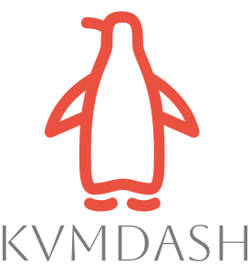

# Projektbeschreibung: KVMDash

<table style="border-collapse: collapse; width: 100%;">
    <tr>
        <td style="width: 150px; padding: 10px; vertical-align: middle;">
            
        </td>
        <td style="padding: 10px; vertical-align: middle;">
            KVMDash ist eine Webanwendung, die die Verwaltung von Virtual Machines (VMs) auf Linux-Systemen ermöglicht. 
            Mit einer benutzerfreundlichen Oberfläche erleichtert KVMDash die Administration und Überwachung von Virtualisierungsumgebungen.
        </td>
    </tr>
</table>


## Features

### VM Verwaltung
* Erstellen, Löschen und Konfigurieren von VMs und Containern über die Weboberfläche.
* Nutzung von Vorlagen für die schnelle und standardisierte Erstellung von VMs.

### Systemmonitoring
* Echtzeitüberwachung von Ressourcen wie CPU, Arbeitsspeicher, Festplattenauslastung und weiteren wichtigen Systemmetriken.
* Übersichtliche Darstellung der Systemleistung für eine optimale Kontrolle und Fehleranalyse.


## Videos

https://github.com/user-attachments/assets/a991f259-7aa8-493f-af48-32413d03c780


## Voraussetzung

* Node.js 18.x oder neuer
* npm 9.x oder neuer

**Ein Linux-System mit:**
* Installiertem KVM (Kernel-based Virtual Machine).
* Installiertem libvirt für die Verwaltung von Virtualisierungsressourcen.
* Installiertem KVMDash-API - https://github.com/zerlix/KVMDash-API


## Installation

1. Repository klonen:
```bash
git clone https://github.com/zerlix/KVMDash.git kvmdash
cd kvmdash
```
2. Submodule initialisieren und aktualisieren (für [Spice Client](https://gitlab.freedesktop.org/spice/spice-html5))
```bash
git submodule update --init --recursive
```

3. SPICE HTML5 Client konfigurieren
```bash
cp src/assets/spice-html5/package.json.in src/assets/spice-html5/package.json
sed -i 's/VERSION/0.3/g' src/assets/spice-html5/package.json
```

4. Dependencies installieren:
```bash
npm install
```

5. Entwicklungsserver starten:
```bash
npm run dev
```

## Konfiguration
**API Endpoint konfiguration**

In der Datei .env muss die VITE_API_URL auf den API Host zeigen

```bash
VITE_API_URL=http://kvmdash.back/api
```


